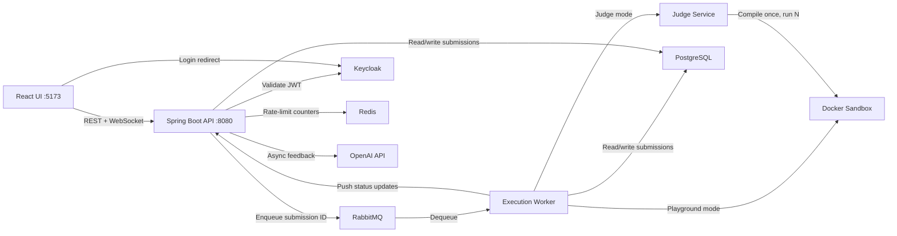

# CodeRank

An online code execution and judging platform, similar to LeetCode or Codeforces. CodeRank accepts source code submissions via a REST API and a React web UI, compiles and runs them inside hardened Docker sandbox containers, and delivers real-time execution results over WebSocket.

**Key capabilities:**
- React web UI with Monaco code editor, real-time status updates, and problem browsing
- Submit Java source code with optional stdin input via API or UI
- **Judge mode**: Submit against problems with hidden test cases, automatic verdict determination
- **AI feedback**: On-demand code review powered by OpenAI (or any OpenAI-compatible API)
- Sandboxed compilation and execution inside ephemeral Docker containers
- Real-time status updates via WebSocket (STOMP) -- watch your code go from QUEUED to COMPILING to RUNNING to COMPLETED
- Verdicts: ACCEPTED, WRONG_ANSWER, COMPILATION_ERROR, RUNTIME_ERROR, TIME_LIMIT_EXCEEDED, MEMORY_LIMIT_EXCEEDED
- Per-problem time/memory limits and configurable test case visibility
- Guest (unauthenticated) and registered user flows with per-user rate limiting
- Keycloak-based authentication with OAuth2/OIDC
- Extension point system (SPI) for plugins that hook into the submission lifecycle

---

## Architecture



| Component | Role |
|-----------|------|
| **React UI** | Web interface with Monaco code editor, problem browser, submission history, AI feedback panel, and real-time result display. |
| **Spring Boot API** | Accepts submissions, serves problems and results, validates JWTs, manages WebSocket connections, proxies AI feedback requests. |
| **RabbitMQ** | Decouples the API from execution workers. Submissions are enqueued by ID so the message payload stays small. |
| **Execution Worker** | RabbitMQ consumer that routes between playground mode (raw execution) and judge mode (test case evaluation). |
| **Judge Service** | Compiles code once, runs against all test cases in a single container, compares output via exact match (whitespace-trimmed). |
| **Docker Sandbox** | Ephemeral, hardened container (no network, no capabilities, PID/memory limits) that compiles and runs user code in isolation. |
| **PostgreSQL** | Stores users, submissions, problems, test cases, and AI feedback. Flyway manages schema migrations. |
| **Keycloak** | OAuth2/OIDC identity provider. Issues JWTs for registered users; the API never handles raw passwords. |
| **Redis** | Backs rate-limiting counters and response caching. |
| **OpenAI API** | On-demand AI code review. Async, decoupled — results delivered via WebSocket. Configurable provider (OpenAI, Gemini, etc.). |

### Data Flow

#### Playground Mode (free-form execution)

1. User writes code in the Monaco editor (or sends a POST to the API directly).
2. UI/Client POSTs source code to `/api/v1/submissions`.
3. API persists the submission (status: `QUEUED`) and enqueues its ID to RabbitMQ.
4. API returns `202 Accepted` with the submission ID and a WebSocket topic path.
5. UI subscribes to `/topic/submissions/{id}` over STOMP and shows live status transitions.
6. Worker dequeues the ID, fetches the submission from PostgreSQL, and transitions through `COMPILING` -> `RUNNING`.
7. Worker spins up a Docker sandbox container, bind-mounts the source code, and waits for the result.
8. Worker persists the verdict and pushes the final status over WebSocket.
9. UI renders the verdict, stdout, stderr, and execution time in the ResultPanel.

#### Judge Mode (problem-based evaluation)

1. User selects a problem from the problem list and writes a solution.
2. UI POSTs source code with `problemId` to `/api/v1/submissions`.
3. Same enqueue flow as playground mode (steps 3-6 above).
4. Worker detects `problemId` and routes to JudgeService instead of raw execution.
5. JudgeService fetches all test cases, writes them to a temp directory, and calls the sandbox with `judge-entrypoint.sh`.
6. Sandbox compiles once, runs against each test case, outputs structured JSON delimited by `===CODERANK_RESULT===`.
7. JudgeService parses results, compares actual vs expected output (exact match, whitespace-trimmed), determines per-test verdict.
8. Visibility filter applied (SHOW_FIRST_FAILING / SHOW_SAMPLE_ONLY / SHOW_NONE) before sending to client.
9. UI renders passed/total test case summary and per-test-case results with verdict chips.

#### AI Feedback (on-demand)

1. User clicks "Get AI Feedback" on a completed submission.
2. UI POSTs to `/api/v1/submissions/{id}/feedback` (returns `202 Accepted` immediately).
3. AiFeedbackService runs async: fetches submission context, calls OpenAI chat completions API.
4. Response saved to `ai_feedbacks` table and pushed via WebSocket to the same submission topic.
5. UI renders the AI feedback in the AiFeedbackPanel.

---

## Tech Stack

| Component | Technology | Purpose |
|-----------|-----------|---------|
| Frontend | React 18, TypeScript, Vite | Web UI with hot reload |
| UI Library | MUI (Material UI) | Component library and theming |
| Code Editor | Monaco Editor | VS Code-style code editing |
| State Management | Zustand | Lightweight global state |
| Auth (Frontend) | keycloak-js | Keycloak SSO integration |
| Runtime | Java 21 (Temurin) | Application and sandbox JDK |
| Framework | Spring Boot 3.3.5 | Web, security, messaging, data |
| Database | PostgreSQL 16 | Persistent storage for users and submissions |
| Migrations | Flyway | Versioned database schema management |
| Message Broker | RabbitMQ 3.13 | Asynchronous job queue for submissions |
| Cache / Rate Limiting | Redis 7 | Rate-limit counters, response caching |
| Identity | Keycloak 24 | OAuth2/OIDC authentication and user management |
| Sandbox | Docker (docker-java 3.3.6) | Isolated code execution containers |
| Rate Limiting | Bucket4j 8.10.1 | Token-bucket rate limiter |
| WebSocket | STOMP over WebSocket | Real-time execution status push |
| Testing | Testcontainers, JUnit 5, MockMvc | Integration testing with real Postgres and RabbitMQ |
| Build | Maven (API), npm (UI) | Dependency management and build lifecycle |

---

## Project Structure

```
coderank/
├── docker-compose.yml                    # Shared infrastructure (Postgres, RabbitMQ, Redis, Keycloak)
├── docker/
│   ├── init-db.sh                        # Creates separate Keycloak database
│   └── sandbox/
│       ├── Dockerfile                    # Hardened JDK 21 Alpine image
│       ├── entrypoint.sh                # Playground: compile-and-run script
│       └── judge-entrypoint.sh          # Judge: compile once, run N test cases
├── docs/                                 # Design docs and plans
├── README.md
│
├── coderank-api/                         # Spring Boot backend
│   ├── pom.xml
│   └── src/main/java/com/coderank/
│       ├── config/
│       │   ├── SecurityConfig.java       # HTTP security, CORS, JWT validation
│       │   ├── RabbitMQConfig.java       # Queue and exchange declarations
│       │   ├── WebSocketConfig.java      # STOMP broker and endpoint
│       │   ├── DockerConfig.java         # DockerClient bean
│       │   ├── RateLimitConfig.java      # Rate-limit thresholds
│       │   ├── RateLimitFilter.java      # Token-bucket filter
│       │   ├── AiConfig.java            # AI provider settings (key, model, base URL)
│       │   └── AsyncConfig.java         # Thread pool for async AI tasks
│       ├── controller/
│       │   ├── SubmissionController.java # POST, GET, GET list
│       │   ├── ProblemController.java    # GET problems, GET by id/slug
│       │   ├── AiFeedbackController.java # POST request feedback, GET stored feedback
│       │   ├── HealthController.java     # Liveness probe
│       │   ├── LanguageController.java   # Supported languages
│       │   └── GlobalExceptionHandler.java
│       ├── dto/
│       │   ├── SubmissionRequest.java    # + problemId for judge mode
│       │   ├── SubmissionResponse.java   # + test case results, pass/total counts
│       │   ├── ExecutionStatusMessage.java
│       │   ├── ProblemResponse.java      # Problem with sample test cases
│       │   ├── TestCaseDto.java          # Input/expected output pair
│       │   ├── TestCaseResultDto.java    # Per-test verdict, output, timing
│       │   └── AiFeedbackMessage.java    # AI feedback WebSocket payload
│       ├── model/
│       │   ├── Submission.java           # + problem FK, passedTestCases, totalTestCases
│       │   ├── Problem.java             # Title, slug, difficulty, constraints, limits
│       │   ├── TestCase.java            # Input, expected output, sample flag
│       │   ├── AiFeedback.java          # Stored AI feedback with token usage
│       │   ├── ExecutionResult.java
│       │   ├── JudgeResult.java         # Aggregate verdict + per-test results
│       │   ├── TestCaseResult.java      # Single test case result
│       │   └── enums/
│       │       ├── Language.java
│       │       ├── SubmissionStatus.java
│       │       ├── Verdict.java
│       │       ├── Difficulty.java       # EASY, MEDIUM, HARD
│       │       └── TestCaseVisibility.java # SHOW_FIRST_FAILING, SHOW_SAMPLE_ONLY, SHOW_NONE
│       ├── repository/
│       │   ├── SubmissionRepository.java # + findByIdWithProblem (JOIN FETCH)
│       │   ├── ProblemRepository.java    # findBySlug, findByDifficulty
│       │   ├── TestCaseRepository.java   # findByProblemId, findSampleOnly
│       │   └── AiFeedbackRepository.java # findBySubmissionId
│       ├── service/
│       │   ├── SubmissionService.java    # + problem linking for judge mode
│       │   ├── ProblemService.java       # Problem CRUD + sample test cases
│       │   ├── AiFeedbackService.java   # Async OpenAI integration (@ConditionalOnProperty)
│       │   └── WebSocketNotificationService.java # + sendAiFeedback
│       ├── judge/
│       │   ├── JudgeService.java        # Compile once, run N, compare outputs
│       │   └── OutputComparator.java    # Exact match, whitespace-trimmed
│       ├── worker/
│       │   ├── ExecutionWorker.java      # Routes playground vs judge mode
│       │   └── DockerSandboxManager.java # + reusable runContainer() method
│       └── extension/
│           ├── SubmissionEventListener.java
│           └── SubmissionEventPublisher.java
│
└── coderank-ui/                          # React frontend
    ├── package.json
    ├── vite.config.ts                    # Dev server with API/WS proxy
    ├── .env                              # API URLs, Keycloak config
    └── src/
        ├── main.tsx                      # Keycloak init, providers
        ├── App.tsx                       # Router + layout
        ├── theme.ts                      # MUI dark/light theme
        ├── components/
        │   ├── layout/                   # Navbar, Footer, ProtectedRoute
        │   ├── editor/                   # CodeEditor (Monaco), LanguageSelector
        │   ├── submission/               # SubmitButton, ResultPanel, SubmissionCard, AiFeedbackPanel
        │   └── problem/                  # ProblemCard, ProblemDetail
        ├── pages/
        │   ├── Landing.tsx               # Hero + features
        │   ├── Playground.tsx            # Free-form code execution
        │   ├── Problems.tsx              # Problem listing from API
        │   ├── ProblemView.tsx           # Split: problem + editor + judge results + AI feedback
        │   ├── Submissions.tsx           # Submission history
        │   └── SubmissionDetail.tsx       # Single submission view + AI feedback
        ├── stores/                       # Zustand (auth, submission, theme)
        ├── services/                     # Keycloak, Axios, WebSocket, problemApi, aiFeedbackApi
        └── utils/                        # Types, constants, formatters
```

---

## Getting Started

### Prerequisites

- **Java 21** (Temurin recommended)
- **Maven 3.9+**
- **Node.js 18+** and **npm**
- **Docker** (daemon must be running)

### Setup Steps

**1. Clone the repository**

```bash
git clone https://github.com/JayaharishMR/CodeRank.git
cd CodeRank/coderank
```

**2. Start infrastructure services**

```bash
docker compose up -d
```

This starts PostgreSQL (port 5432), RabbitMQ (ports 5673/15673), Redis (port 6379), and Keycloak (port 9090).

**3. Build the sandbox image**

```bash
cd docker/sandbox
docker build -t coderank-sandbox-java .
cd ../..
```

**4. Configure Keycloak**

Open [http://localhost:9090](http://localhost:9090) and log in with `admin` / `admin`.

1. Create a new realm named `coderank`.
2. Create a client:
   - Client ID: `coderank-ui`
   - Client type: OpenID Connect
   - Client authentication: OFF (public client)
   - Valid redirect URIs: `http://localhost:5173/*`
   - Valid post logout redirect URIs: `http://localhost:5173/*`
   - Web origins: `http://localhost:5173`
3. Create a test user with username and password (set Temporary to OFF).

**5. Start the backend**

```bash
cd coderank-api
mvn spring-boot:run
```

The API will be available at [http://localhost:8080](http://localhost:8080).

**5b. (Optional) Enable AI Feedback**

```bash
export AI_API_KEY=sk-your-openai-key
export CODERANK_AI_ENABLED=true
mvn spring-boot:run
```

Works with any OpenAI-compatible API. For Gemini:

```bash
export AI_API_KEY=your-gemini-key
export AI_BASE_URL=https://generativelanguage.googleapis.com/v1beta/openai
export AI_MODEL=gemini-2.0-flash
```

**6. Start the frontend**

```bash
cd coderank-ui
npm install
npm run dev
```

The UI will be available at [http://localhost:5173](http://localhost:5173).

**7. Verify**

```bash
# API health check
curl http://localhost:8080/api/v1/health
# {"status":"UP"}

# Open the UI
open http://localhost:5173
```

---

## UI Pages

| Page | Path | Description |
|------|------|-------------|
| **Landing** | `/` | Hero section with CTA buttons, feature cards |
| **Playground** | `/playground` | Free-form code editor with submit and real-time results |
| **Problems** | `/problems` | Problem listing fetched from API with difficulty badges |
| **Problem View** | `/problems/:slug` | Split view: problem description + editor + judge results + AI feedback |
| **Submissions** | `/submissions` | Submission history list (authenticated only) |
| **Submission Detail** | `/submissions/:id` | Full submission view with source code, test results, and AI feedback |

### Key UI Features

- **Monaco Editor**: VS Code-style code editing with Java syntax highlighting
- **Real-time Status**: Live progress stepper (QUEUED → COMPILING → RUNNING → COMPLETED) via WebSocket
- **Judge Results**: Passed X/Y test case summary, per-case verdict chips with expected/actual output
- **AI Feedback**: On-demand code review with loading state and WebSocket delivery
- **Verdict Display**: Color-coded verdict chips (green=Accepted, red=Error, orange=TLE)
- **Dark/Light Mode**: Toggle via navbar icon, persisted in Zustand store
- **Guest Access**: Submit code without logging in (Playground)
- **Keycloak SSO**: Login/logout via Keycloak redirect, silent token refresh

---

## API Reference

### GET /api/v1/health

Liveness probe. No authentication required.

**Response** `200 OK`

```json
{
  "status": "UP"
}
```

---

### GET /api/v1/languages

Returns the list of supported programming languages. No authentication required.

**Response** `200 OK`

```json
["JAVA"]
```

---

### POST /api/v1/submissions

Submit code for execution. No authentication required (guests allowed). Rate-limited.

**Request body**

```json
{
  "language": "JAVA",
  "sourceCode": "public class Main { ... }",
  "stdin": null,
  "problemId": null
}
```

| Field | Type | Required | Constraints |
|-------|------|----------|-------------|
| `language` | string | Yes | Must be `JAVA` |
| `sourceCode` | string | Yes | Non-blank, max 51200 characters |
| `stdin` | string | No | Program input (piped to stdin). Ignored in judge mode. |
| `problemId` | UUID | No | Links submission to a problem for judge mode. Omit for playground. |

**Response** `202 Accepted`

```json
{
  "id": "a1b2c3d4-e5f6-7890-abcd-ef1234567890",
  "status": "QUEUED",
  "verdict": "PENDING",
  "sourceCode": "public class Main { ... }",
  "stdout": null,
  "stderr": null,
  "executionTimeMs": null,
  "memoryUsedKb": null,
  "errorMessage": null,
  "wsChannel": "/topic/submissions/a1b2c3d4-e5f6-7890-abcd-ef1234567890",
  "createdAt": "2026-05-25T10:30:00Z",
  "problemId": null,
  "passedTestCases": null,
  "totalTestCases": null,
  "testCaseResults": null
}
```

**Error responses**

| Status | Reason |
|--------|--------|
| `400 Bad Request` | Validation failure (blank source code, unsupported language) |
| `429 Too Many Requests` | Rate limit exceeded |

---

### GET /api/v1/submissions

List recent submissions (newest first, max 50). **Requires authentication** (Bearer JWT).

**Response** `200 OK`

```json
[
  {
    "id": "...",
    "status": "COMPLETED",
    "verdict": "ACCEPTED",
    "sourceCode": "...",
    "stdout": "Hello, CodeRank!\n",
    "stderr": null,
    "executionTimeMs": 1523,
    "memoryUsedKb": null,
    "errorMessage": null,
    "wsChannel": "/topic/submissions/...",
    "createdAt": "2026-05-25T10:30:00Z"
  }
]
```

---

### GET /api/v1/submissions/{id}

Retrieve a submission by ID. No authentication required.

**Response** `200 OK` — same shape as above.

---

### GET /api/v1/problems

List all problems (newest first). No authentication required.

**Response** `200 OK`

```json
[
  {
    "id": "ac2d30a5-...",
    "title": "Two Sum",
    "slug": "two-sum",
    "difficulty": "EASY",
    "description": "Given an array of integers...",
    "constraints": ["2 <= nums.length <= 10^4", "Only one valid answer exists."],
    "starterCode": "import java.util.*;\n\npublic class Main { ... }",
    "timeLimitMs": 2000,
    "memoryLimitKb": 262144,
    "sampleTestCases": [
      { "input": "4\n2 7 11 15\n9", "expectedOutput": "[0, 1]" }
    ]
  }
]
```

---

### GET /api/v1/problems/{idOrSlug}

Retrieve a single problem by UUID or slug. No authentication required.

**Response** `200 OK` — same shape as above.

---

### POST /api/v1/submissions/{id}/feedback

Request AI-generated feedback for a completed submission. Returns immediately; feedback is delivered asynchronously via WebSocket.

**Response** `202 Accepted`

```json
{ "status": "processing" }
```

**Error responses**

| Status | Reason |
|--------|--------|
| `503 Service Unavailable` | AI feedback is not enabled (no API key configured) |

---

### GET /api/v1/submissions/{id}/feedback

Retrieve stored AI feedback for a submission.

**Response** `200 OK`

```json
{
  "submissionId": "a1b2c3d4-...",
  "type": "AI_FEEDBACK",
  "feedback": "Your solution uses a HashMap approach with O(n) time complexity...",
  "model": "gpt-4o-mini",
  "timestamp": "2026-05-31T10:30:00Z"
}
```

**Response** `404 Not Found` — no feedback exists for this submission.

---

### WebSocket: /ws/execution

Real-time execution updates via STOMP over WebSocket.

**Connect**

```
ws://localhost:8080/ws/execution
```

**Subscribe** to a submission's status updates:

```
SUBSCRIBE /topic/submissions/{submissionId}
```

**Message payload** (pushed by the server at each status transition):

```json
{
  "id": "a1b2c3d4-e5f6-7890-abcd-ef1234567890",
  "status": "RUNNING",
  "verdict": "PENDING",
  "stdout": null,
  "stderr": null,
  "executionTimeMs": null,
  "memoryUsedKb": null,
  "errorMessage": null,
  "timestamp": "2026-05-25T10:30:02Z",
  "passedTestCases": null,
  "totalTestCases": null,
  "testCaseResults": null
}
```

The client receives messages as execution progresses: `QUEUED` -> `COMPILING` -> `RUNNING` -> `COMPLETED` (or `FAILED`).

In judge mode, the final `COMPLETED` message includes `testCaseResults` — an array of per-test-case verdicts filtered by the problem's visibility setting.

**AI Feedback messages** are also delivered on the same topic:

```json
{
  "submissionId": "a1b2c3d4-...",
  "type": "AI_FEEDBACK",
  "feedback": "Your solution uses a HashMap...",
  "model": "gpt-4o-mini",
  "timestamp": "2026-05-31T10:30:05Z"
}
```

The client distinguishes between execution updates and AI feedback by checking the `type` field.

---

## Security

### Sandboxing (6 Layers)

Every code submission runs inside an ephemeral Docker container with multiple layers of isolation:

| Layer | Mechanism | Details |
|-------|-----------|---------|
| **Container isolation** | Docker container | Each submission gets its own container, destroyed after execution. No cross-submission interference. |
| **Network disabled** | `--network none` | Container has zero network access. No exfiltration, no lateral movement, no downloading dependencies. |
| **Resource limits** | Memory cap, CPU limit, PID limit | `--memory 256m`, `--cpus 1`, `--pids-limit 50`. Prevents OOM-killing the host and fork bombs. |
| **Execution timeout** | Hard kill after N seconds | Container is force-killed if it exceeds the configured timeout (default: 10s). |
| **Code restrictions** | Capability drop, no-new-privileges | `--cap-drop ALL`, `--security-opt no-new-privileges`. Drops all Linux capabilities and blocks setuid/setgid escalation. |
| **Image hardening** | Non-root user, no network tools | Sandbox runs as an unprivileged user (`coderank`). `wget` and `curl` are removed from the image. Shell is `/bin/false`. |

### Authentication

CodeRank uses **Keycloak** as its OAuth2/OIDC identity provider.

- The API acts as an **OAuth2 Resource Server**, validating JWTs issued by the Keycloak `coderank` realm.
- The UI uses **keycloak-js** for SSO redirect login with silent token refresh.
- **Guest flow:** Anonymous users can submit code via the Playground without logging in. Results are delivered over WebSocket and persisted in the database.
- **Registered user flow:** Authenticated users can view their submission history and access protected routes.

### Rate Limiting

Rate limiting is applied only to `POST /api/v1/submissions` (the only endpoint that triggers expensive Docker execution).

| User Type | Requests per Minute | Key |
|-----------|-------------------|-----|
| Guest (unauthenticated) | 5 | IP address |
| Registered user | 20 | Principal name |

Implemented with **Bucket4j** token-bucket algorithm. Configurable via `application.yml`.

---

## Database Schema

Managed by Flyway (`V1__init_schema.sql`, `V2__judge_and_ai.sql`). Uses Postgres-native ENUMs for type safety at the database level.

### Tables

**users**

| Column | Type | Constraints |
|--------|------|-------------|
| `id` | UUID | Primary key, auto-generated |
| `keycloak_id` | VARCHAR(255) | Not null, unique |
| `username` | VARCHAR(100) | Not null |
| `email` | VARCHAR(255) | Not null |
| `created_at` | TIMESTAMP | Not null, default `NOW()` |

**problems**

| Column | Type | Constraints |
|--------|------|-------------|
| `id` | UUID | Primary key, auto-generated |
| `title` | VARCHAR(255) | Not null |
| `slug` | VARCHAR(255) | Not null, unique |
| `difficulty` | difficulty | Not null (EASY, MEDIUM, HARD) |
| `description` | TEXT | Not null |
| `constraints` | JSONB | Not null |
| `starter_code` | TEXT | Not null |
| `time_limit_ms` | INT | Default 2000 |
| `memory_limit_kb` | INT | Default 262144 |
| `test_case_visibility` | test_case_visibility | Default SHOW_FIRST_FAILING |
| `created_at` | TIMESTAMP | Not null, default `NOW()` |
| `updated_at` | TIMESTAMP | Not null, default `NOW()` |

**test_cases**

| Column | Type | Constraints |
|--------|------|-------------|
| `id` | UUID | Primary key, auto-generated |
| `problem_id` | UUID | FK -> problems(id) CASCADE, not null |
| `input` | TEXT | Not null |
| `expected_output` | TEXT | Not null |
| `is_sample` | BOOLEAN | Default false |
| `order_index` | INT | Not null. Unique per (problem_id, order_index) |
| `created_at` | TIMESTAMP | Not null, default `NOW()` |

**submissions**

| Column | Type | Constraints |
|--------|------|-------------|
| `id` | UUID | Primary key, auto-generated |
| `user_id` | UUID | FK -> users(id), nullable (guest) |
| `problem_id` | UUID | FK -> problems(id) SET NULL, nullable (playground) |
| `language` | language | Not null, default `JAVA` |
| `source_code` | TEXT | Not null |
| `stdin` | TEXT | Nullable |
| `status` | submission_status | Not null, default `QUEUED` |
| `verdict` | verdict | Not null, default `PENDING` |
| `stdout` | TEXT | Nullable |
| `stderr` | TEXT | Nullable |
| `execution_time_ms` | BIGINT | Nullable |
| `memory_used_kb` | BIGINT | Nullable |
| `error_message` | TEXT | Nullable |
| `passed_test_cases` | INT | Nullable (judge mode only) |
| `total_test_cases` | INT | Nullable (judge mode only) |
| `created_at` | TIMESTAMP | Not null, default `NOW()` |

**ai_feedbacks**

| Column | Type | Constraints |
|--------|------|-------------|
| `id` | UUID | Primary key, auto-generated |
| `submission_id` | UUID | FK -> submissions(id), not null |
| `feedback` | TEXT | Not null |
| `model` | VARCHAR(100) | Nullable |
| `prompt_tokens` | INT | Nullable |
| `completion_tokens` | INT | Nullable |
| `created_at` | TIMESTAMP | Not null, default `NOW()` |

---

## Configuration

All CodeRank-specific properties live under the `coderank.*` prefix in `application.yml`.

| Property | Default | Description |
|----------|---------|-------------|
| `coderank.execution.timeout-seconds` | `10` | Max wall-clock time for execution |
| `coderank.execution.memory-limit-mb` | `256` | Memory cap per sandbox container |
| `coderank.execution.cpu-count` | `1` | CPU cores per container |
| `coderank.execution.max-stdout-bytes` | `65536` | Max stdout captured (64 KB) |
| `coderank.execution.pid-limit` | `50` | Fork-bomb protection |
| `coderank.docker.sandbox-image` | `coderank-sandbox-java` | Sandbox Docker image name |
| `coderank.rate-limit.guest-requests-per-minute` | `5` | Guest rate limit per IP |
| `coderank.rate-limit.user-requests-per-minute` | `20` | Authenticated user rate limit |
| `coderank.ai.enabled` | `false` | Enable AI feedback (env: `CODERANK_AI_ENABLED`) |
| `coderank.ai.api-key` | — | API key (env: `AI_API_KEY`) |
| `coderank.ai.model` | `gpt-4o-mini` | Model name (env: `AI_MODEL`) |
| `coderank.ai.base-url` | `https://api.openai.com/v1` | API base URL (env: `AI_BASE_URL`). Works with any OpenAI-compatible API (Gemini, Ollama, etc.) |
| `coderank.ai.max-tokens` | `1024` | Max tokens for AI response |
| `coderank.ai.temperature` | `0.7` | Sampling temperature |

---

## Extension System (SPI)

CodeRank includes a Service Provider Interface (SPI) that lets you hook into the submission lifecycle without modifying core pipeline code.

```java
public interface SubmissionEventListener {
    default void onSubmissionReceived(Submission submission) {}
    default void onSubmissionComplete(Submission submission, ExecutionResult result) {}
    default void onSubmissionFailed(Submission submission, String error) {}
}
```

Implement as a Spring `@Component` to auto-register.

---

## Testing

Integration tests use **Testcontainers** (PostgreSQL + RabbitMQ). Docker client is mocked.

```bash
cd coderank-api
mvn test
```

---

## Roadmap

### Phase 1
- Core execution engine with Docker sandboxing
- Java language support
- REST API with submission lifecycle management
- React web UI with Monaco editor
- Real-time WebSocket status updates
- Keycloak authentication (guest + registered users)
- Configurable rate limiting with Bucket4j
- Extension point system (SPI) for plugins

### Phase 2 (Current)
- **Judge mode**: Problems and test cases in PostgreSQL, compile-once-run-N execution, per-problem time/memory limits, configurable test case visibility
- **AI feedback**: On-demand code review via OpenAI (or any compatible API), async delivery via WebSocket, provider-agnostic configuration

### Phase 3
- **Multi-language support**: Python, C++, and more
- **User dashboard**: Statistics, streaks, and progress tracking
